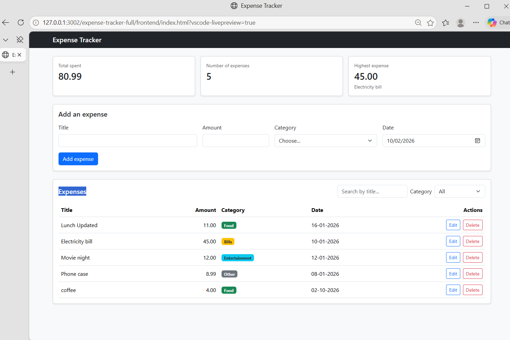
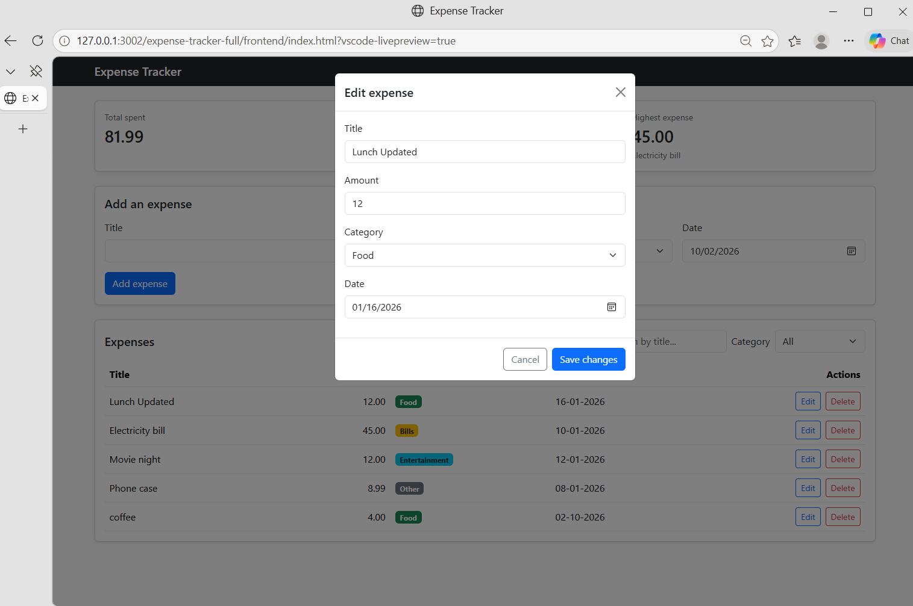
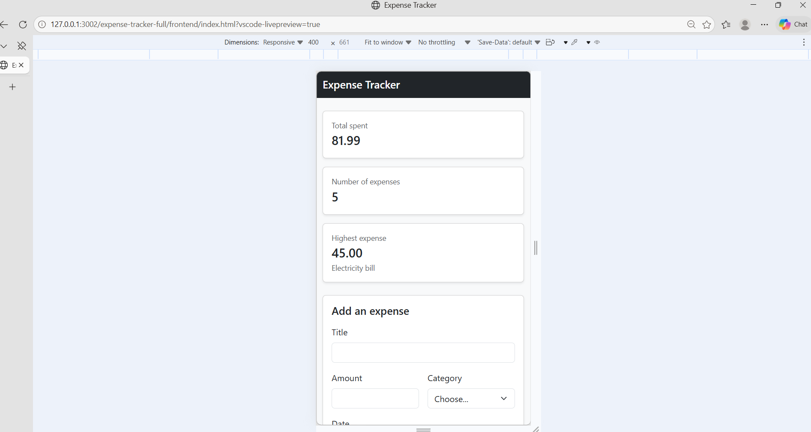
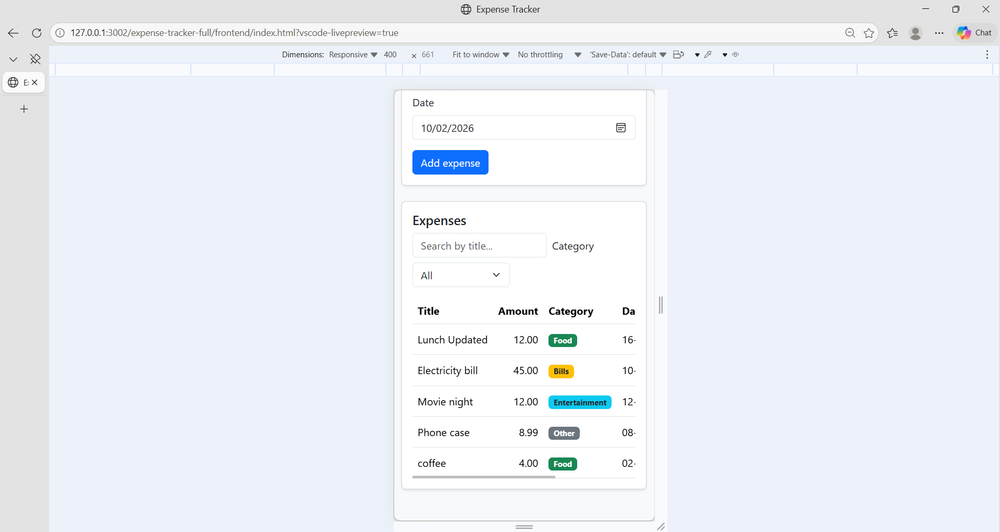
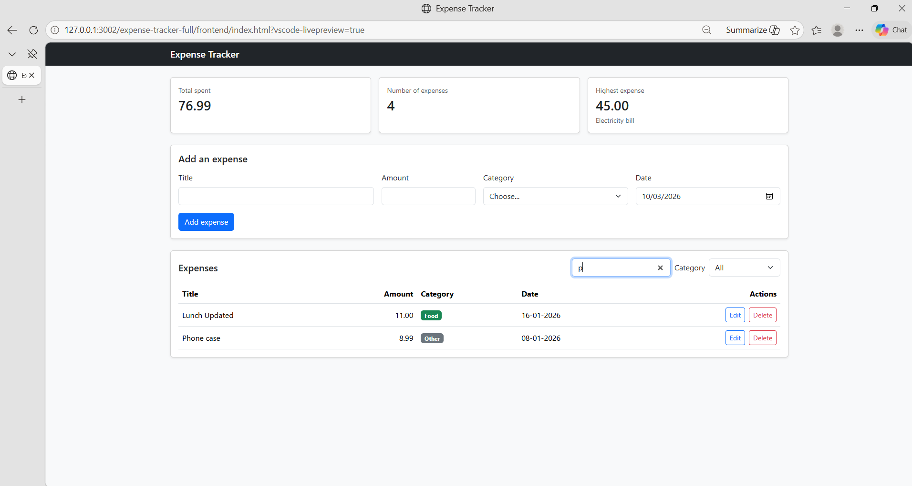

# Expense Tracker

A web app to track personal expenses: add, edit, delete and filter expenses by category, with a live summary (total, count, highest). The frontend talks to an Express API that stores everything in PostgreSQL.

## How to run

**Backend**

1. Create an empty PostgreSQL database named `expense_tracker` (from pgAdmin).
2. Run `backend/schema.sql` on that database (Query Tool in pgAdmin). It creates the `expenses` table and adds sample data.
3. Copy `backend/.env.example` to a new file named `backend/.env` and write my PostgreSQL password in `DB_PASSWORD`.
4. In a terminal: `cd backend` then `npm install express cors pg dotenv`.
5. Start the server: `node server.js`. It must stay running and listen on `http://localhost:3000`.

**Frontend**

1. Open the `frontend` folder in VS Code.
2. Right-click `index.html` and choose **Open with Live Server**.
3. The page loads the expenses from the API. If the server is off, a red alert explains it.

## Features

-    Add an expense (with validation)
-    Delete an expense
-    Edit an expense (Bootstrap modal, saved with PUT)
-    Filter by category
-    Bonus: search expenses by title (works together with the category filter)
-    Summary cards (total, count, highest), always calculated from all expenses
-    Data is saved in a PostgreSQL database
-    Loading spinner and clear error alerts
-    Responsive layout (summary cards use CSS Grid)

## Screenshots

## What was the hardest part?

The hardest part was connecting the frontend to the backend. When I first opened
the page, it showed "Cannot reach the server" and no expenses appeared. At first
I did not know if the problem was in my frontend code or in the backend. It turned
out the server was not running, because my project had two nested folders with the
same name and I ran `node server.js` from the wrong one.

I solved it by testing the backend alone first: I started the server from the
correct `backend` folder and opened `http://localhost:3000/api/expenses` in the
browser until I saw the JSON. After that the page worked. This taught me to always
test the API before debugging the frontend, and that the alert message was
correct: it was the page telling me the server was off.

## demo

https://drive.google.com/drive/folders/18RAS9e7nzXxvPAQ56tgo5ErhljiDFiVh?usp=sharing